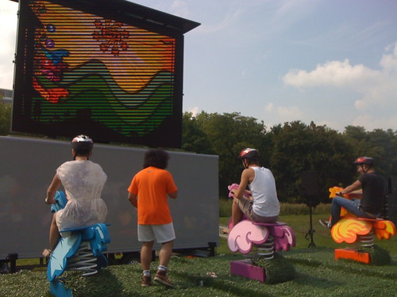

This week was dominated by a bunch of things. Preparations for Stekkerfest and touching up the website for that were very important. Also anticipation for the live demonstration of the first PLAY Pilots live game by [Fourcelabs](http://www.fourcelabs.com/).

Tuesday was the night of the third Amsterdam UX Book Club organized by [Dirk Geurs](http://twitter.com/dirklectisch) and myself. We read the massive tome by Kim Goodwin on [designing for the digital age](http://www.cooper.com/journal/2009/01/designing_for_the_digital_age.html) and we had a great turnout and a lively discussion. Thank you Hyves for hosting and everybody for showing up.

Explorations on getting an identity for [Monster Swell](http://monsterswell.com) are in full swing and we're preparing a bunch of collaborations with friends, and partners to participate in subsidy rounds and contests. Expect more visibility on our part soon.

The week culminated on Saturday with [Stekkerfest](http://www.zoekjestekker.nl/) and the running of [the Wip 'N' Kip game](http://playpilots.nl/games/wip-n-kip/). Suffice to say that it was every bit as awesome as everybody thought and a lot of fun was had. Massive kudos to the equippe by [Fourcelabs](http://www.fourcelabs.com/) that brought it all together.

We'll be busy incorporating the live game results into the [PLAY Pilots](http://playpilots.nl) website, but that is stuff for a future weeknote.
