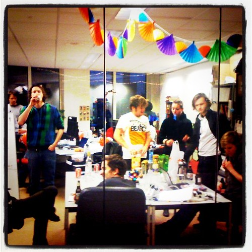
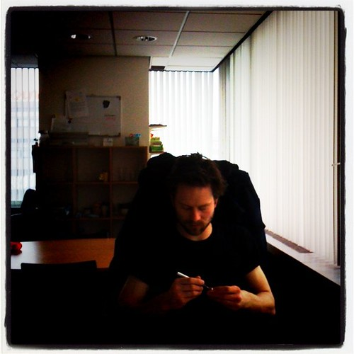
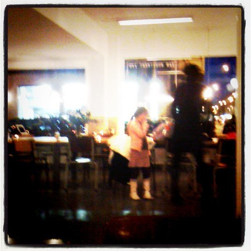
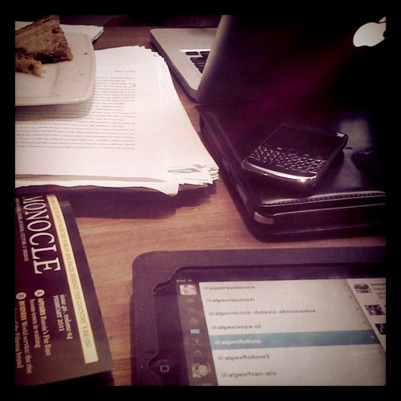

Solid progress on Maguro in Utrecht. Spent a large amount of time over there also to evaluate the [PLAY Pilots](http://playpilots.nl/) project's succes. Started building a prototype that runs more in real-time and on timed events (and all that in a traditional web framework).

Progress on the design framework of [Statlas](http://statlas.nl). This week we should see that coming together and look at the progress on the renderer, but I'm getting ahead of ourselves here. I rounded up the [research I did on personal mapping platforms](http://monsterswell.com/blog/2011/01/personal-mapping-platforms/) that are online now.

Dinner with [Johnny Wonder Jaap](http://johnnywonder.nl/blog/mensen/jaapstronks/) was nice, collaboration on the public affairs side of things looks promising:

Apps for Amsterdam should come along nicely and we should announce a bunch of stuff this week (or else!). You can pencil in March 12th as the next [Hack de Overheid](http://www.hackdeoverheid.nl) event but don't tell anybody I told you.

I also went to the [Open Streetmap](http://www.openstreetmap.nl/) drinks in Amsterdam. [Wherecamp EU](http://wherecamp.eu/) may take place in Amsterdam, so that would be very good geo news.

