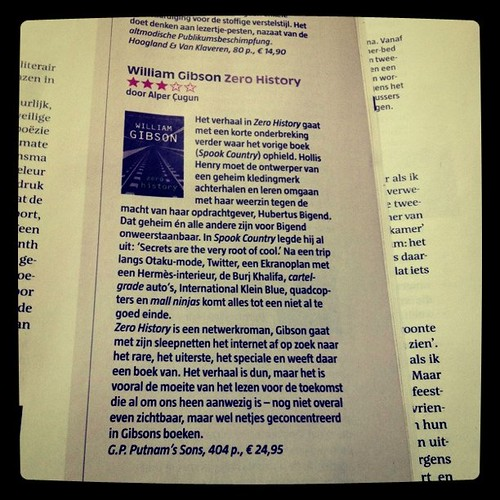
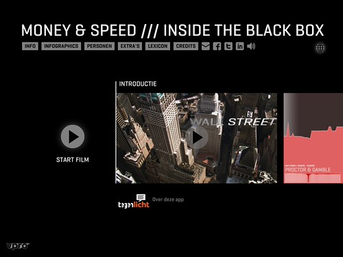
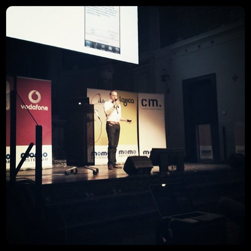
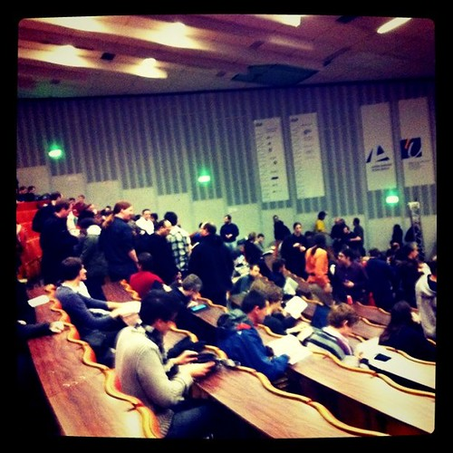
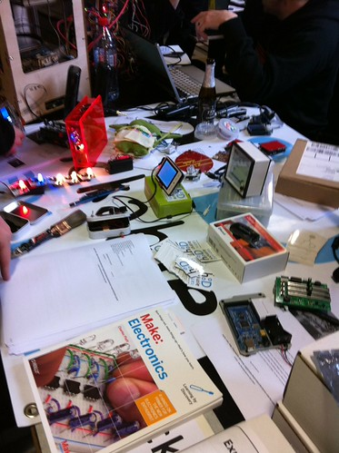
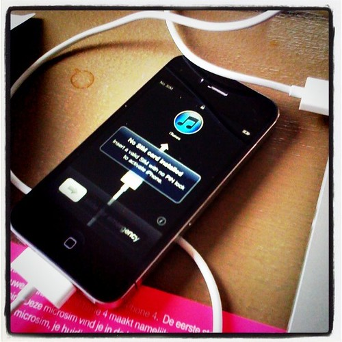
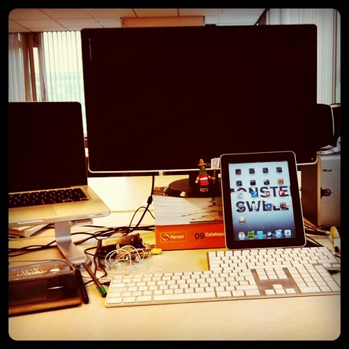

### Work

Made a lot of progress on [Statlas](http://statlas.nl) during the course of the week. The domain should be live this week and we should see tangible results this month.

_Maguro_ got updated and deployed again.

Planned the ineraction and design for _acapulco_ and briefed designer [Martijn Broekman](http://www.martijnbroekman.nl/). Finally finished those wireframes in a café in Brussels and sent them in.

Made a tentative start on _hermosillo_.

[Mony](http://twitter.com/#!/simeonnedkov) dropped by for a crash course in [Django](http://djangoproject.com/) and he promptly ported his entire Layar project [TUdar](http://www.gdmc.nl/tudar/) over.

We setup a [Github organization for Hack de Overheid](https://github.com/organizations/HackdeOverheid) to get the code conversation flowing before the event and give our code a place to live after. Also got a ton of communication things done for the event on March 12th.

### Teaching

I also had a meeting to draft the road map for the small minor in data visualization I will be giving at the [Willem de Kooning Academie](http://www.wdka.nl/) in Rotterdam. Also I prepared the first lesson during the weekend (lesson day: Monday).

### Writing

Got my [review of “Zero History”](http://www.vn.nl/boeken/fictie/zero-history-william-gibson/) by [William Gibson](http://twitter.com/greatdismal) published on de Republiek der Letteren ( _the Republic of Literature_). I had spent quite some time writing and polishing it and I was quite pleased with having it published.

That also went into print that same Thursday, so yeah pretty cool:

I also [published my review](http://monsterswell.com/blog/2011/01/tegenlicht-money-speed-%E2%80%94%C2%A0a-touch-documentary/) of the [iPad episode](http://itunes.apple.com/nl/app/money-speed-inside-black-box/id411884445?mt=8) “Money & Speed”of the [Tegenlicht](http://tegenlicht.vpro.nl/) documentary I got a preview of.

The site for the [Apps for Amsterdam](http://www.appsforamsterdam.nl/) application contest went live. Thanks to the [Waag Society](http://www.waag.org/) for putting that online so quick. We of [Hack de Overheid](http://www.hackdeoverheid.nl) are going to work with them to make it one hell of an open data wave this year.

### Events

I attended [Mobile Monday](http://www.mobilemonday.nl/) mainly to see [Ville Vesterinen](http://twitter.com/vesterinen) present about their pervasive magic game [Shadow Cities](http://www.shadowcities.com/).

On Saturday I made a quick trip to Brussels to attend [FOSDEM](http://fosdem.org) which I had never attended before. It was a fun chance to sit in the DataDevroom and watch presentations about open source data processing and graph visualizations. It was good to meet fabricator [Rejon](http://rejon.org) again too (who I had last said goodbye to in Damascus).
What I noticed though at FOSDEM was the nearly complete absence of web development and assorted technologies. Also that while you cannot go to a technology conference these days without being hit by ethics and politics, that engagement was strangely absent at FOSDEM (except probably in the keynote by Eben Moglen).

I also registered for the [Infographics](http://www.infographics.eu) congress on March 4th though I find the focus on print media and infographics archaic and distasteful. Let's see if we can change that.

### Hardware

Got myself an iPhone4 because the old 3G wasn't pulling it anymore after the countless iOS upgrades it had seen.

Also got an iPad keyboard dock from the bargain bin. Thanks [Maarten den Braber](http://twitter.com/mdbraber) for picking that up for me. Seems I have turned into that [Apple](http://www.apple.com) completionist:

