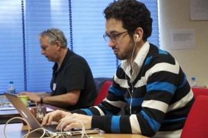

_Maguro_ got its next test and nicely stood up to everything thrown at it.

‘PvdA — Altijd in de buurt’ ( _hermosillo_) was put live just before the elections and was announced [here](http://www.arnhem-direct.nl/berichten/20110226_pvda_vraagt_wat_er_beter_kan_in_jouw_buurt) [and](http://sargasso.nl/archief/2011/02/26/pvda-koppelt-best-geslaagd-direct-contact-met-kiezers-aan-een-2-0-website/) [there](http://nu.pvda.nl/berichten/2011/02/Lancering-website-PvdA-altijd-in-de-buurt.html).

I got called an ‘open data goeroe’ by the VPRO on [their hackday report](http://weblogs.vpro.nl/nederlandvanboven/2011/02/18/fotoverslag-app-in-a-day/), which I don't know what to think about.

The rest of the week was spent finalizing _maguro_ functionally and Friday I briefly visited the [Infographics](http://infographics.eu) congress which was ahem revealing in all its traditional glory. Let's keep it at that.

 by illustir, on Flickr")
