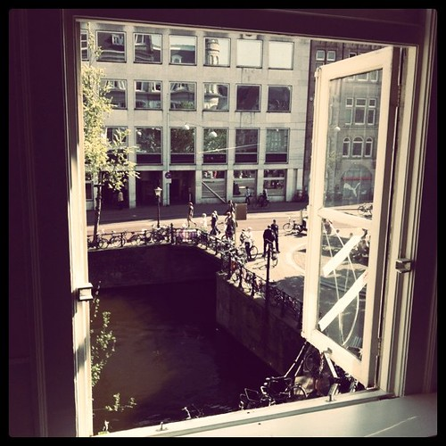
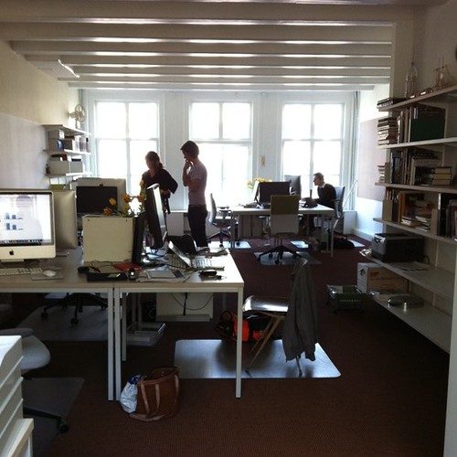
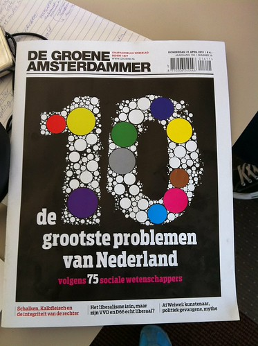
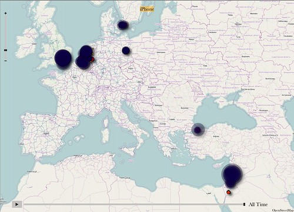

A busy week, _maguro_ got completely finished and delivered to client. _Culiacan_ managed to overcome the horrible [Media Temple](http://mediatemple.net/) hurdle.

I spent a day working on _potosi_ on site at [de Groene Amsterdammer](http://www.groene.nl) at their swanky new pad on the Singel which [went live](http://www.groene.nl/2011/16/interactief-de-volledige-bijdragen-van-75-sociale-wetenschappers) that very same day.

_Merida_ went into its final sprint and is almost ready for prime time.

Also talks about studio++ began to coalesce and the real estate search is about to start in earnest as soon as I tie up the last loose ends of my own move.

Blogged one piece about the open data victory over the Dutch Railways: [“Dutch Train Times are open”](/dingen/2011/04/dutch-train-times-are-open/)

Also posted my obligatory iPhone trail of the past half year:

