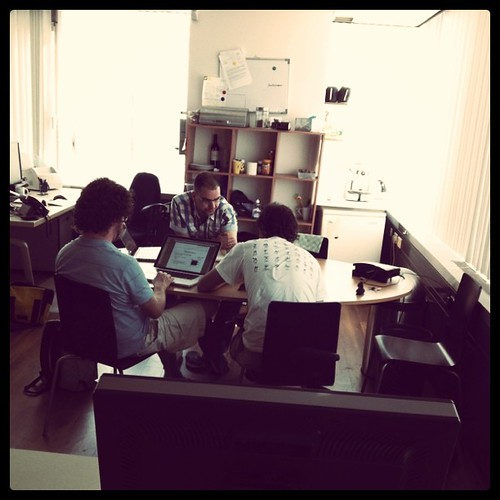
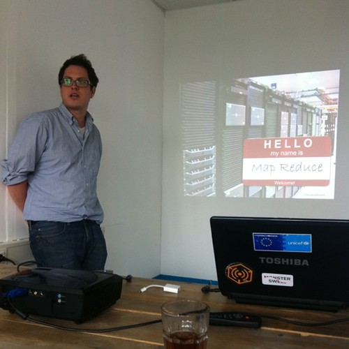

Is it Wednesday already? We're a bit in a production down cycle, but you wouldn't notice for the lack of administrativa that needs dealing with.

Blogged about project _potosi_: [Interactive Infographic for de Groene Amsterdammer](http://monsterswell.com/blog/2011/04/interactive-infographic-for-de-groene-amsterdammer/) also blogged about _hermosillo_: [Mapping voter sentiment in the Netherlands](http://monsterswell.com/blog/2011/04/mapping-voter-sentiment-in-the-netherlands/)

We did a bunch of writing among which some proposals for academic conferences where we are going to drop some knowledge & praxis.

_Culiacan_ and Statlas are moving forward at a steady pace.

A large part of last week was spent preparing the presentation for [/dev/haag](http://devhaag.nl/) ambitiously titled “Fixing Reality with Data Visualization”. The slides of which are forthcoming in long form.

This week we will be at Mediamatic's [Data Visualization Barcamp](http://www.mediamatic.net/page/207517/en) t, probably presenting some new work and also at a workshop hosted by [VURB](http://www.vurb.eu/) and VOLUME with architects and programmers. If you see us at either, do say hi!
