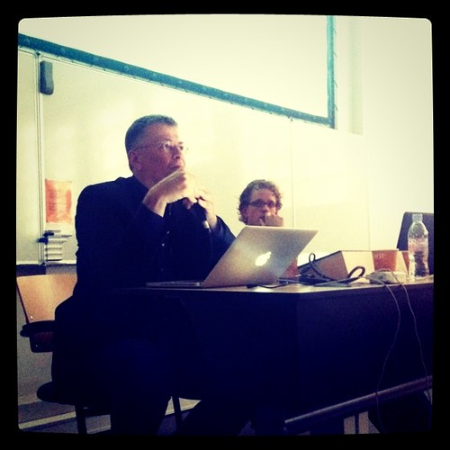
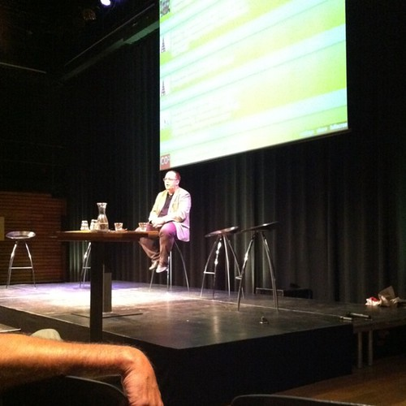

Monday I did some support and then went off to the UvA to present on data journalism together with [Stef](http://twitter.com/stefvangrieken).

Tuesday I was in Utrecht to work on the Code 4 presentation for [CHI Sparks](http://chi-sparks.nl/). Working at the garden again was a very enjoyable experience made more so by the unexpected visit of [Christine](http://twitter.com/x10tje) who's making forays into game design herself.

A lot of the rest of the week was occupied with testing and preparing [Statlas](http://statlas.nl) for a launch this week, which [it did](http://monsterswell.com/blog/2011/06/statlas-beta-release/), so you can [check it out](http://statlas.nl) and read more about that in next week's notes.

Mr. Morozov visited the Netherlands which made for an interesting night out along with a very unexpected meetup with [Babak](https://twitter.com/#!/mastababa) and Ulla.

My takeaway from Evgeny Morozov can be summarized in [this tweet](https://twitter.com/#!/alpercugun/status/83661041015328768):

> Conclusion of a night with @evgenymorozov: government meddling on the internet doesn't do us any good and can only hurt us in the long run.

Government control of the internet's technologies seldom nets anything and is usually implemented on the back of scare tactics about terrorism or child pornography. When things turn sour, the systems that were deployed can be used to a very great effect against the entire population without much effort. This means it is imperative to maintain a free and open internet to safeguard freedom.

Thursday it was off to Arnhem to present at the [CHI Sparks](http://chi-sparks.nl/) conference. The place where all seriously academic HCI people get together to present their findings. I presented on a serious game we made with Hubbub in [the Games and Play track](http://chi-sparks.nl/program/session/games-and-play). Thanks to the organization for giving us the stage and thanks for the [kind](https://twitter.com/#!/pboersma/status/83830202672758784) [support](https://twitter.com/#!/iskandr/status/83831321872437248) [from](https://twitter.com/#!/iskandr/status/83829801495969792) friends in the audience. I hope our presentation was worth your while.

And that was that, like I said, this week is even more exciting and with the return of [Kars](https://twitter.com/#!/kaeru) from the Land of the Rising Sun, it promises to become a hot Summer.
