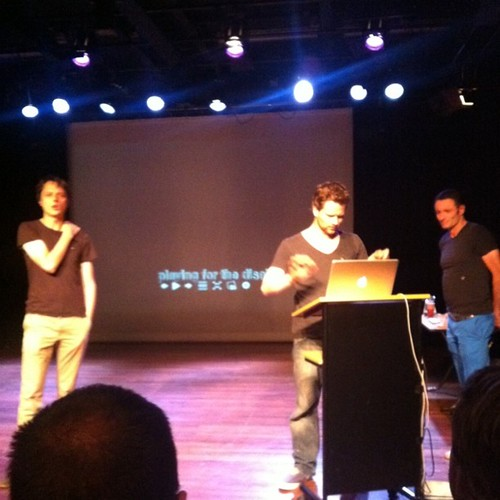
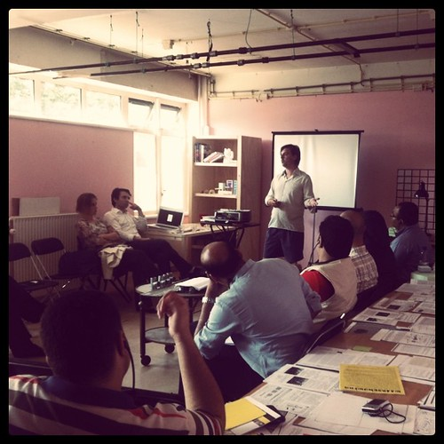
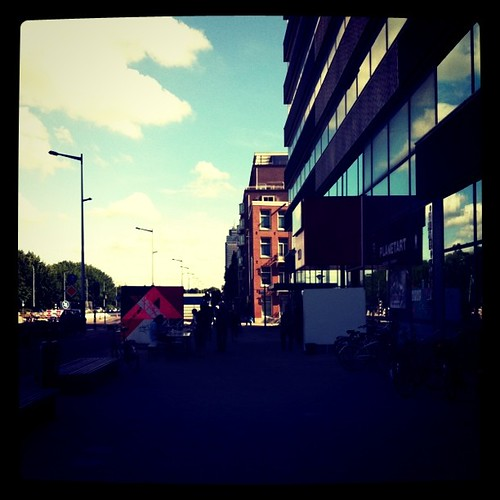
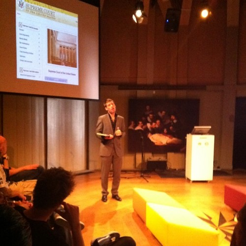
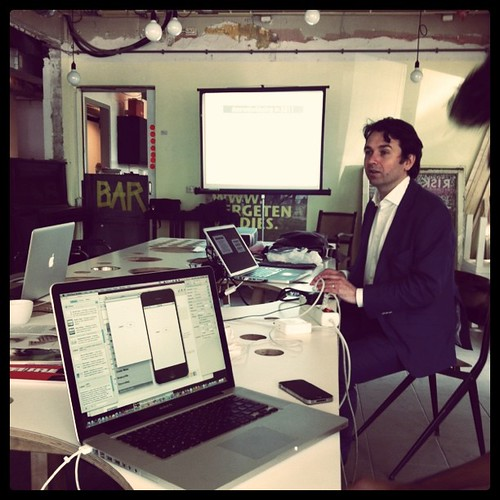
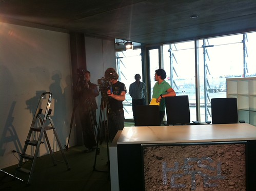
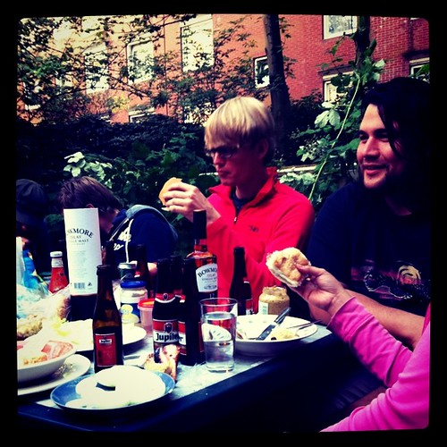

Monday I spent all day planning the [Statlas](http://statlas.nl) release and encountered some showstoppers still. That night I went to Utrecht for [This Happened](http://thishappened.nl/).

Tuesday was another day spent in Utrecht and in between things I pushed out the releases for Statlas with posts in [Dutch](/dingen/2011/06/statlas-beta-versie/) and [English](http://monsterswell.com/blog/2011/06/statlas-beta-release/).

Also I [managed to bait](https://twitter.com/#!/alper/status/86377686913654785) ( [thread](http://www.exquisitetweets.com/tweets?eids=gxIUjWRnht.gxJgWZfjOK.gxJlGXqSJg.gxJrnMx13s.gxKVYYcurc.gxLHqSBlL2.gxL1Mqv8lp)) Dutch member of parliament Jeanine Hennis on the topic of her party's (the VVD) entanglement with large corporate interest when it comes to copyright law (or any internet related law). There is a lot more to be said about this topic and I don't know how effective this is as a strategy, but somebody should do this.

Thursday there was a meeting about game journalism at the Waag (and a [flurry](http://blog.waag.org/?p=4519) [of](http://bashers.nl/serieuze-gamejournalisten) [coverage](http://bashers.nl/volwassen-gamejournalistiek-uitvinden) of the topic this week), by [Niels](http://twitter.com/nielsthooft) and [David](http://twitter.com/gamespacenl):

That and other engagements however did mean that I had to miss the [Cognitive Cities Salon](http://conference.cognitivecities.com/2011/06/cocities-salon-amsterdam/) (though [I heard](http://thirdwaveberlin.com/2011/07/cognitive-cities-amsterdam/) it was most ace).

Friday was spent doing iPhone tutorials all day and night to get up to speed on this medium and to create some interesting interface experiments in the near future.

The entire weekend was spent working unfortunately. Saturday we talked about the potential merger of [Hack de Overheid](http://hackdeoverheid.nl) and [het Nieuwe Stemmen](http://www.hetnieuwestemmen.nl/) to formalize an already ongoing collaboration and create a more robust organization.

Sunday I acted as the jury member in a pilot for an interaction design television programme. It's not clear yet whether it will be produced, but it would be a good step forward popularizing the more functional design disciplines.

