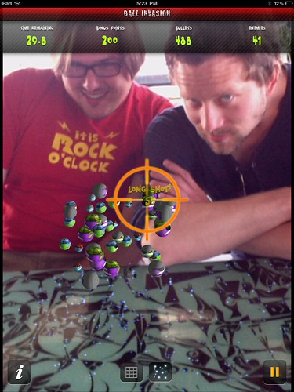
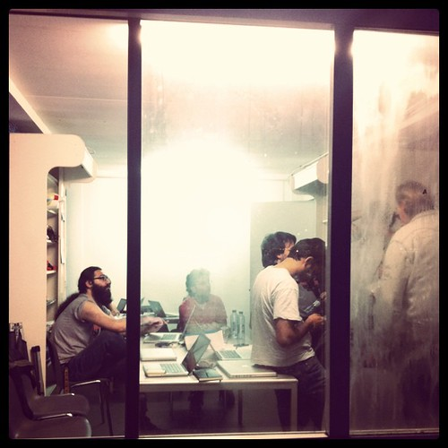

Last week a bunch of visual progress was made on _culiacán_. Expect an August release on that.

Also [a longer version of my review](http://bashers.nl/inside-a-star-filled-sky-%E2%80%94%C2%A0in-de-monsters-zitten-monsters) of [Inside a Star-filled Sky](http://insideastarfilledsky.net/) was posted to Bashers. Seemingly any post that does not contain meta-criticism has a hard time attracting comments over there (maybe everywhere). More stuff was published also [about Jason Rohrer](http://pinboard.in/u:alper/t:jasonrohrer/), especially of note [the Wired piece about Chain World](http://www.wired.com/magazine/2011/07/mf_chainworld/all/1).

Mid-week marked the first deployed iteration of _guadalupe_. If development on that goes the way we want it, expect private alpha invites to become available also in August.

End of the week we spent a bunch of time doing a submission to SxSWi to talk about [the Heist Model](/dingen/2010/09/not-hiring-anybody/). It's an edgy philosophy and a fun way of working, which we look forward to expound in Austin accompanied by friends, margaritas and BBQ.

Friday there was [Ball Invasion](http://itunes.apple.com/us/app/ball-invasion-for-ipad2/id444853211?mt=8) (with friends):

After which I managed to get stuck with a car and drive it up North to the [Appsterdam HQ](https://foursquare.com/venue/24477969) for the iOS Devcamp that was in progress.

The weekend was marked by rainy misery and [a short piece of writing](http://www.hackdeoverheid.nl/2011/07/open-data-ingebed-in-amsterdam-cetrum/) about open data becoming a normal practice of Amsterdam City-Center.
