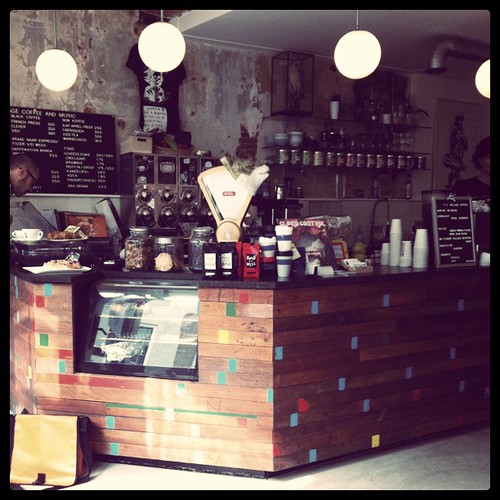

A bunch of work on finalizing Code 4, work on _culiacan_ continues steadily nearing a launch sometime soon, and kicking off ideation and sketches for _tlalnepantla_.

Nice to get recognition for writing from long long in the past. James [linked to an old piece](http://www.redmonk.com/jgovernor/2011/07/29/redmonk-is-hiring-data-scientistsgriots-please-apply/comment-page-1/) I [wrote about getting stories](/dingen/2010/07/distilling-meter-rhyme-and-verse-from-your-database/) from your database.

[Apps for Noord Holland](http://appsfornoordholland.nl/) ( _saltillo_) is this coming Saturday and signups are shaping up nicely. How could they be otherwise for the opportunity to spend a day programming and learning together on a [fortress](http://www.forteiland.nl) from the defense works of Amsterdam. There are still some spots open, so sign up if you want to make it an awesome experience.

I was over at Utrecht last week just to escape the many meetings plaguing me in Amsterdam. A new rule which I will try to adhere to: **I will participate in a maximum of one hour of meetings every week.**  

My [review of the Cat and the Coup](http://bashers.nl/the-cat-and-the-coup) (a documentary game) was published over at Bashers and I wrote [a short Jane Jacobs inspired piece](/dingen/2011/08/sidewalks-on-the-new-marnixstraat/) lamenting the narrow sidewalks of the area I live in.
