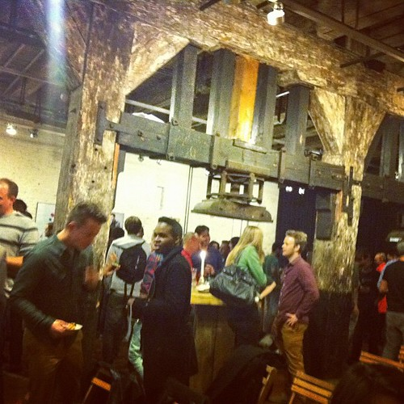
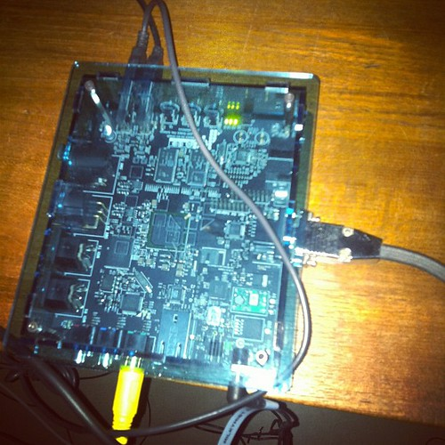
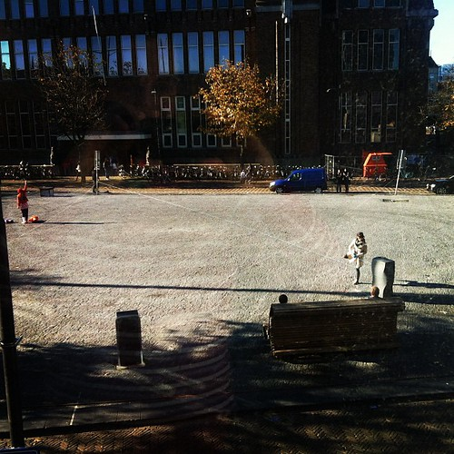
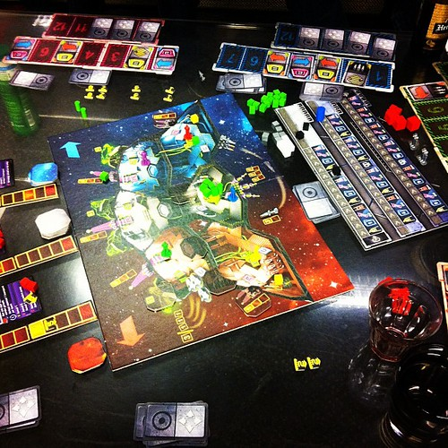
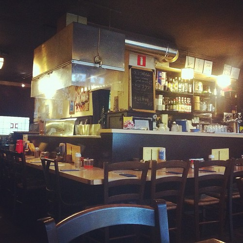

Going on with [Apps voor Nederland](http://appsvoornederland.nl/) and _culiacan_ (which is almost done by now). Also did a brief intermediate scripting and renedring moving text for a [TA](http://www.toneelgroepamsterdam.nl/) theater piece.

Went to the launch of [Vice Netherlands'](http://www.vice.com/nl) web strategy. A nice event, but a bit too reminiscent of the nineties. After that I briefly visited the [Hackers and Founders](http://www.meetup.com/Hackers-and-Founders-Amsterdam-NL/) event as well.

Preparing my move out of the [Volkskrantgebouw](http://www.volkskrantgebouw.nl) as well. My home base in Amsterdam will be our office at the [Open Cooperatie](http://www.opencooperatie.nl/) for the foreseeable future.

}

Friday, I [recorded a message](http://fastmovingtargets.nl/2011/11/07/bericht-uit-de-dutch-game-garden/) from the [Dutch Game Garden](http://www.dutchgamegarden.nl) for Fast Moving Targets, a Dutch online tech news show. I think the things happening at the DGG deserve to be communicated much wider and if I can contribute to that by doing this, I will.

After that we went for a board game night at the garden with ample games of [Space Alert](http://boardgamegeek.com/boardgame/38453/space-alert) and [Nidhogg](http://messhof.com/nidhogg/).

I will be speaking at [the next ignite](http://www.mediamatic.net/page/230079/en) at Mediamatic on the topic of ‘Hacking for Social Justice’ (the thing we do at [Hack de Overheid](http://hackdeoverheid.nl)).

Sunday we started what could be a nice tradition: a brunch time serving of Tonkotsu Ramen at one of the best Japanese places in the city with some very smart people. If it's up to me, that is going to be a regular occurrence.
