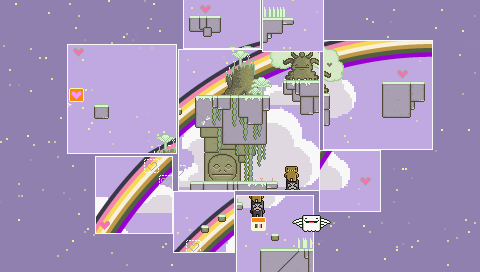

Some remaindered weeknotes that have been the casualty of an international move.

This week marked a strategic planning session for the coming year out of which a lot of opportunity flowed. I also finished [‘Where is my Heart?’](http://www.copenhagengamecollective.org/where-is-my-heart/) for an upcoming [nrc.next](http://www.nrcnext.nl/) review. It is a spectacular piece of work and a total mind altering experience. A well deserved five stars.

Next we did some project planning for a fun little thing ( _saba_) we're going to build in 2012Q1. And then we played [Quarriors](http://boardgamegeek.com/boardgame/91536/quarriors) which I won against all odds ((Me writing this is still a bit of residual fiero.)).

The rest of the week was spent actually writing the review. A lot of time goes into writing a good review. Too much for the regular press to do much of it as I've written here about [Cultural Criticism](/dingen/2011/12/cultural-criticism-without-borders/). I was very pleased with [Niels's](http://nielsthooft.com/) criticism and how the thing turned out (though it would of course have been better with another week spent on it).

Thursday I went to the [Dialogues House](http://www.dialogueshouse.nl/) to see [Yochai Benkler](http://benkler.org/) present on his work and books. The clarity with which he presented complex concepts of value and organization was expected but still good to witness. The Dialogues House though situated a bit unluckily is really a vibrant and creative place.

Then on Friday it was tying off some odds and ends (I added [a view back and forward](https://twitter.com/#!/erwblo/status/147692033107169280) for Fast Moving Targets [year end project](https://twitter.com/#!/erwblo/status/147692033107169280)) and preparing for the [Open Coop](http://www.opencooperatie.nl/) party.

