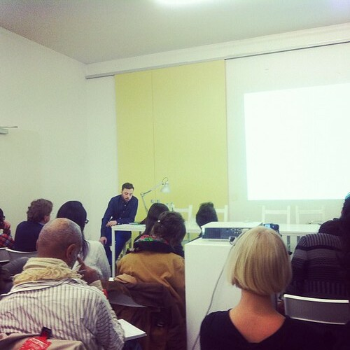
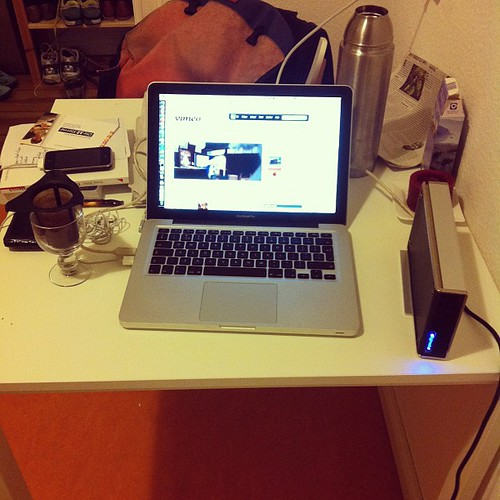

Last week we got the DSL at home to work (in two tries). It feels good to have that after something of a month of bureaucracy and false starts to deal with.

Then I went to [PROGRAM's](http://programonline.de/) last event on [German/Turkish Material Exchange](http://programonline.de/materialexchange.html). An inspiring and eclectic evening and a shame to see the venue being wrapped up.

I met [Peter Wollring](http://peterwollring.com/), a videographer who has made the crossing to Berlin a long time ago, [Peter Tegelaar](https://twitter.com/#!/ptegelaar), a startup veteran from Amsterdam and with [Third Wave](http://thirdwaveberlin.com/).

Finally I got the correct form te become self-employed today from the Finanzamt:

The studio is still elusive, so the kitchen table is where it is at.

