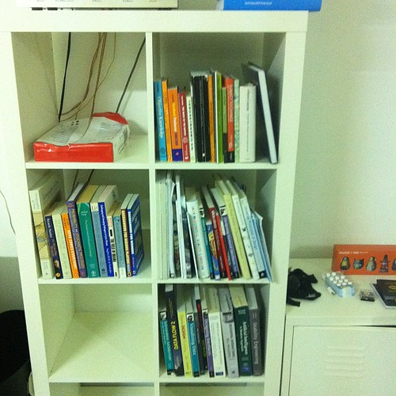
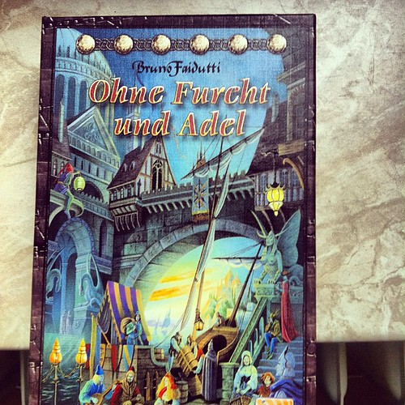
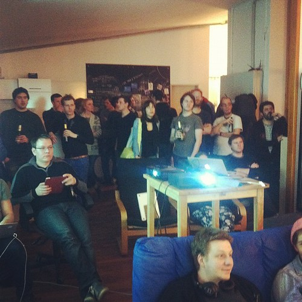
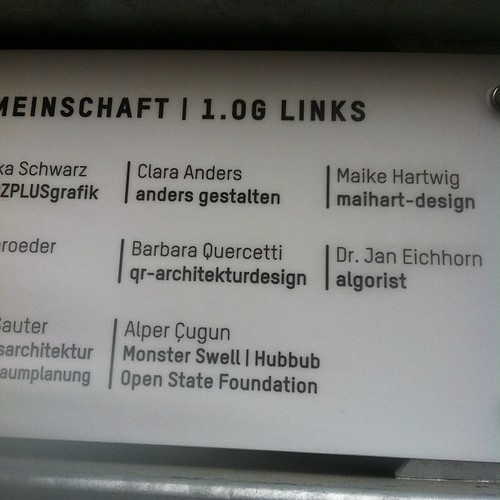

Work continues apace. New websites are forthcoming.

With some heavy lifting in the U-Bahn, I managed to reassemble my library. I eagerly anticipate when I can digitize everything here and not worry about the physicality of my external brain anymore.

[Machiavelli](http://boardgamegeek.com/boardgame/478/citadels) (or Ohne Furcht und Adel or Citadels) is awaiting its first play at the studio the first free Friday we can find.

 by illustir, on Flickr")

The [Apps für Deutschland price winners](http://apps4deutschland.de/preistraeger/) have been announced. We had nothing to do with this competition, but it is interesting to see how this develops alongside the Netherlands.

On Wednesday I went to [co.up](http://co-up.de/) to watch the Stevenote:

I got to catch [Jeroen Visser](https://twitter.com/#!/vizinl) and [Robert Jan Verkade](https://twitter.com/#!/verkade) in Berlin after they had just given a workshop. Dutch website all-stars if ever there were some.

After which I went to [the Mart Stam talks](http://lucas-berlin.blogspot.de/2012/02/mart-stam-talks.html) in [the Dutch embassy in Berlin](http://en.wikipedia.org/wiki/Embassy_of_the_Netherlands,_Berlin). Getting a tour of Koolhaas designed building was a nice addition to the event.

The tour made clear two important parts of the building about which a lot probably has been written but which I'll add here nonetheless:

Our tour guide continued to explain how unpractical various quarters in the building were, how they were not used as much as you would want or expect and how a lot of things had to be patched up after delivery. During the tour one of the [very nice looking skewed doors fell apart](http://www.flickr.com/photos/alper/6818616490/in/photostream) as if to emphasize this again. In more than one place cables were added because the normal connections were not suitable or were too hidden away.

That very unsuitability for human inhabitation and work is a form of power projection. The fact that a government can afford to place an exorbitant impractical building in the middle of another nation's capital to sit there and impress guests is another form of functionality, though at considerable expense.

Add to that the Germans' reactions to the modernity of the building. Many of the (old) people on the tour were very vocally amazed with the material use, furniture and architectural tricks in the building. The building is radical departure from the Berlin tendency towards historicist architecture. Taking both those points, the embassy is ultimately an elaborate joke played by the architect on the German and Dutch people.

Last week also our company names (all three of them!) were mounted on the wall at [the office](https://foursquare.com/v/contur--konsorten/4f391890e4b0179e5f442280) which gives our residency in Berlin a more official air.

