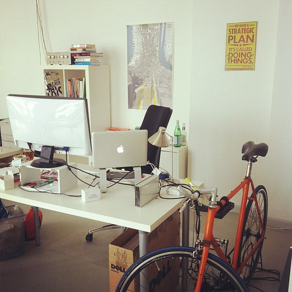
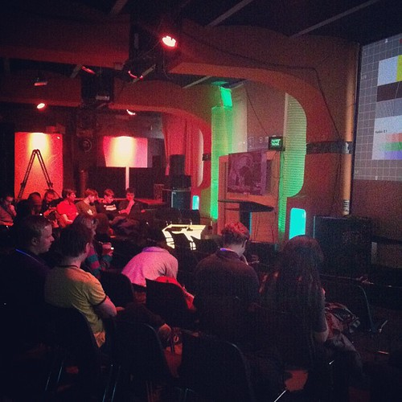
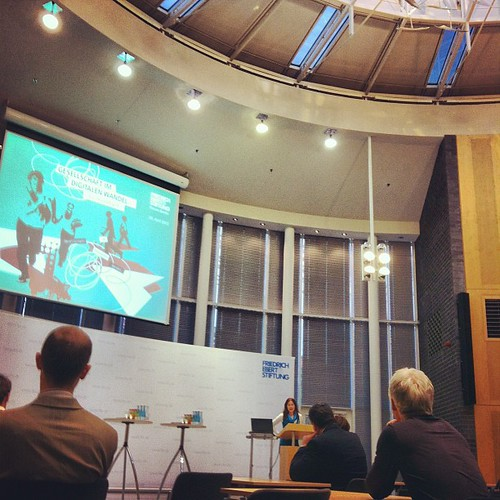
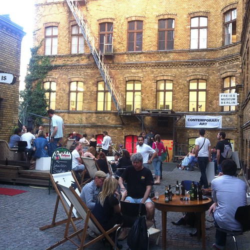

I got a bunch of accessories for the office among which a bike stand:

On Monday I also finished the Thinkup hack I wanted to present at [the Berlin Hack 'n Tell](http://www.meetup.com/berlin-hack-and-tell).

Tuesday was another long sprint on saba and then off to the event. The presentation went quite well and I think I managed to hit both the technical rationale behind the hack as well as its longer term implications.

On Wednesday I wrote up the Thinkup thing over at Monster Swell: [“A full Twitter index in your Thinkup”](http://monsterswell.com/blog/2012/04/a-full-twitter-index-in-your-thinkup/) and requested my full history from Twitter.

More saba. On Thursday I went to [a book presentation](http://jw.is/buchvorstellung-in-berlin-26-april-2012) by [Jonas Westphal](http://twitter.com/westphal) at the FES about the society amidst digital change. It is good that these kind of books are being written to make palatable the socio-technical changes to people not so well versed in these developments. I have several similar reports like this at the studio by the [WRR](http://wrr.nl/), [RMO](http://www.adviesorgaan-rmo.nl/) and by [Rathenau](http://www.rathenau.nl/).

 by illustir, on Flickr")

I also embarked on my first experiment in [Taobao](http://www.taobao.com/index_global.php) shopping (inspired by [Jan Chipchase](http://janchipchase.com/)). If this is succesful, I'm quite sure this will be the first of many more.

And finally on the weekend it was the gallery weekend here in Berlin and I took the chance to visit half a dozen in half an hour.

