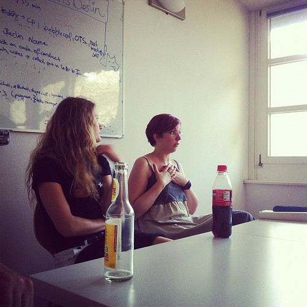
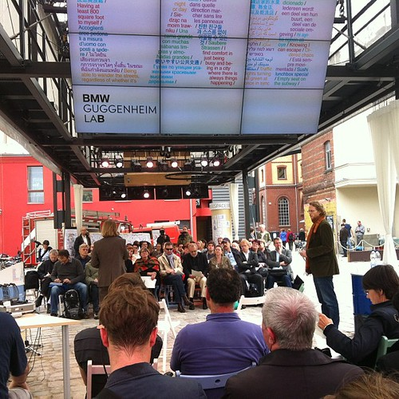
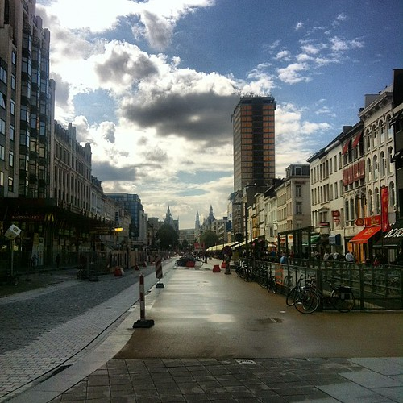

A busy week after a quiet weekend. Monday evening I attended a preliminary meeting with fellow coaches for the Berlin Python classes. After that I attended the Iron Blogger regular meetup to have beer with my fellow Berlin bloggers. Later that week I also attended the regular [Campus Party](http://www.campus-party.eu/) drinks.

Also it was announced that we will be presenting in Helsinki on [the Dutch E-Culture Days](http://virtueelplatform.nl/activiteiten/dutcheculturedays) (here's [a summary](http://www.pixelache.ac/helsinki/2012/dutch-e-culture-days/)).

Tuesday afternoon we met up with some fellow digital urbanites at the [HIIG](http://www.hiig.de/) to discuss research avenues for data in the city. As practitioners we all do not have much time to busy ourselves with formal research, but it is good to update those that do with some of our actual concerns from the field.

The authority of the HIIG may be a useful instrument in reconstructing our governance models in the light of digitization. They are failing on almost every level because of the inherent complexities of network technology. We need to educate scholars, policy makers and pretty much everybody.

Also [my NEXT Berlin talk recording](http://nextberlin.eu/2012/07/alper-cugun-love-in-times-of-gamification/) was published. A fun event where I tried together love and games by frantically pointing at things while stepping just shy of innuendo.

Friday I put the final touches on Beestenbende (see [these weeknotes over at Hubbub](http://whatsthehubbub.nl/blog/2012/07/week-152/)) and visited some sessions at [the Guggenheim Lab](http://www.bmwguggenheimlab.org/) about real estate politics.

Then the last day of last week it was time to pack up everything and embark on a somewhat long trip. First stop: Ghent.

