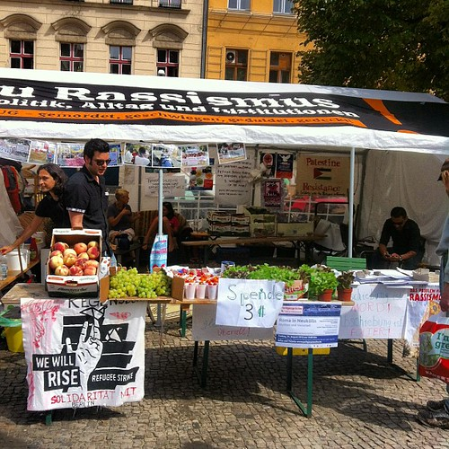
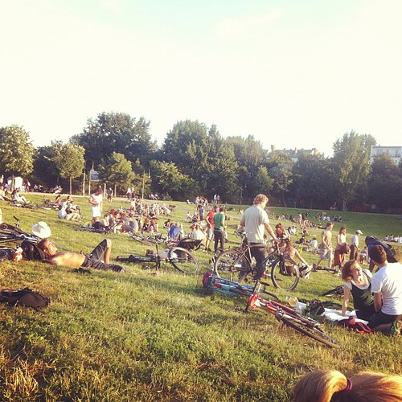

A delayed picture in picture from me presenting in Helsinki:

Some of my writing got some renewed attention. The play Ten Billion was picked up by a Dutch daily and my review got a wholly forgettable comment, which did force me to [clarify some points myself](/dingen/2012/07/ten-billion-by-katie-mitchell-and-stephen-emmott/#comment-9739). But I'm afraid that most of the abstract thought I'm riffing off these days from [Ribbonfarm](http://www.ribbonfarm.com/) does not translate well to the continental European context both in terms of culture and complexity.

https://twitter.com/dannie/status/235373465295798273

I also finished my piece about [the BMW Guggenheim Lab](/dingen/2012/08/het-bmw-guggenheim-lab-in-berlijn/) that took place in Berlin this summer. The event was well done, the program had something for everybody and some of the web components I got to play with were really nice. Though there was still a lack of real engagement and therefore a lack of real change.

> **ci·ty·jerk** (noun, portmanteau of city and circlejerk): high modernist gathering of architects and designers talking about urban experiences from which they are wholly detached

 

Lots of work this week on [Pig Chase](http://www.playingwithpigs.nl/) getting the iPad client version to work for initial prototyping.

I visited the Berlin Google offices to attend a lecture by [Ben Scott](http://en.wikipedia.org/wiki/Ben_Scott_(policy_advisor)) about the potential of the internet. An absurdly self-serving piece of rhetoric that briefly summarized said: Germans are stupid to be wary of the internet and it is in fact holding them back. If they manage to trust the web and open up to its promise, everything will be fine and dandy.

 by illustir, on Flickr")

Friday I had beers over at [Praxis](http://praxisberlin.net/) which will be my new offices from September onwards.

I'm also working on a proposal and subsequent script for a privacy based [Nordic LARP](http://nordiclarpwiki.org/wiki/Main_Page). It's going to be interesting and uncompromising and I could use help.
