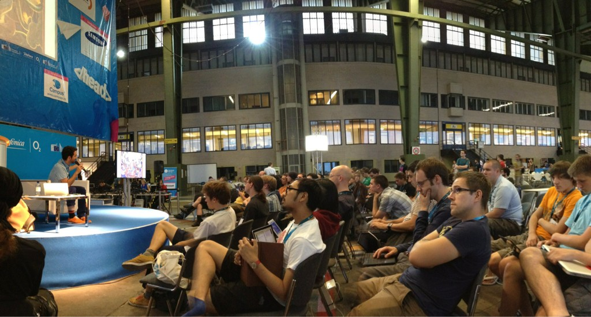

Last week was rather eventful. I popped over to [Praxis](http://praxisberlin.net/) to sign my lease there and I was scheduled to present a workshop at Campus Party on a topic near to my heart about which I have presented often already in one form or another: [Civic Hacking](https://www.campus-party.eu/2012/free-software.html#AlperÇugun).

On Tuesday I attended [the django meetup](http://lanyrd.com/2011/djub-16/) organized by my good friends from [Gidsy](https://gidsy.com/). It's always a pleasure to touch base with the current technological state of the art and best practices in web development, though I am not a web developer _pur sang_ anymore.

On Wednesday I dropped by at the Campus Party venue which at the vast Tempelhof area was as impressive as expected and spent the rest of the time preparing my workshop.

On Thursday evening I [presented the points of view we have](https://speakerdeck.com/u/alper/p/civic-hacking) on the topic as the last entry on a full Free Software Stage. The idea is that programmers and other makers can use their skills to make things and by doing so create a free world (necessary for free software).

https://twitter.com/karstenkneese/statuses/238701118513893376

https://twitter.com/FrauLea/statuses/238700483097808896

A picture by [Gulius Caesar](https://twitter.com/guliuscaesar):

On Friday it was back to the Campus Party to see the presentation by [the Rails Girls Berlin](http://railsgirlsberlin.de/). On the whole Campus Party was a great event with so much interesting stuff happening (a bit too much at times), but with also a lot of odd kinks in the organization which are neatly [summarized over at Silicon Allee](http://siliconallee.com/editorial/2012/08/27/cp-vs-toa-considerable-efforts-on-missed-chances).

And after that to see a bunch of pro gaming going on at the arena where I saw a bunch of interesting Star Craft II cast by [Kaelaris](https://twitter.com/kaelaris) and witnessed my first bit of [League of Legends](http://euw.leagueoflegends.com/) ((Some kind of strange Diablo cum Warcraft mix and mash where people click-click-click on each other.)). Witnessing the high level sc2 players up close and seeing their actual APM is rather bizarre.

I have already been watching a bit of sc2 by [Husky](http://www.youtube.com/user/HuskyStarcraft) after which [Frank Lantz](http://twitter.com/flantz) started writing his [Drinking Man's Guide to Watching Starcraft](http://www.edge-online.com/filter/all/tags/3193), which I can recommend to everybody wanting to get into the sport.

