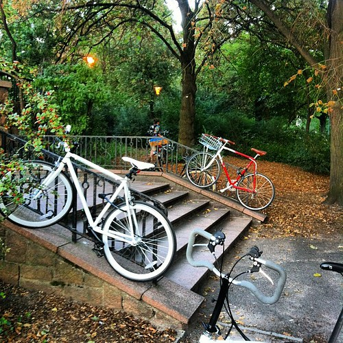
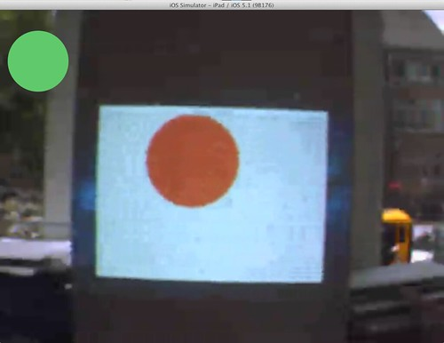
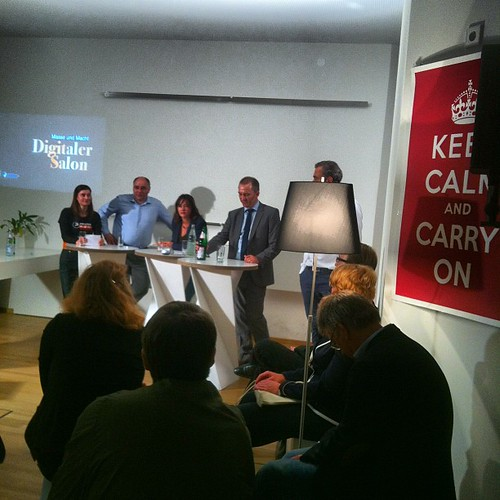
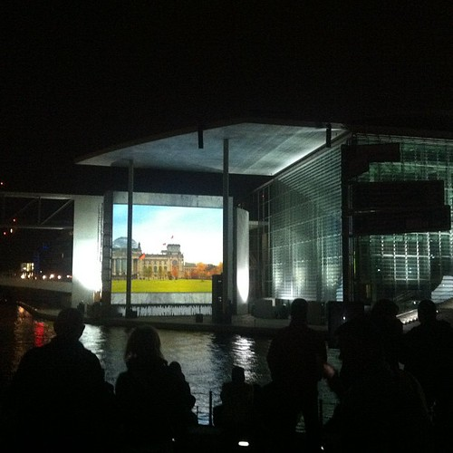
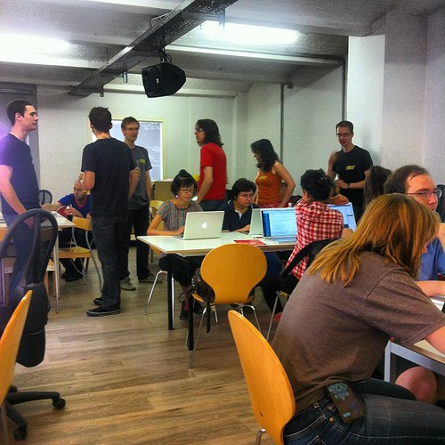

I'll include here [Hubbub's two reasons for celebration](http://whatsthehubbub.nl/blog/2012/09/week-159/) which were also reasons for me to celebrate and I'll add a third in a bit. These really are the weeks when a lot of stuff is happening, being built and delivered. Not that much time for idle talk and reflection, though that too will return.

I also booked my ticket to Australia for the end of October. I'm flying in on Melbourne via Beijing and flying out of Sydney some three weeks later. I always thought I had to see the economic miracle of China for myself, so I'll be stopping over there for a couple of days before going on serious surfing/hiking/diving in Oz.

I also launched an [activity on Gidsy to teach programming to absolute beginners](https://gidsy.com/activities/amsterdam/11034/programming-for-beginners) which —I am glad to say— has been fully booked by now. Strangely enough this is a topic that is massively underrepresented in the Netherlands while in other countries there are [groups popping up](http://railsgirls.com/) left and right. I hope to play some part in spreading knowledge of programming, but I cannot do this by myself and it should spread out to be a wider movement.

Thursday afternoon I spent two and a half hours outputting two and a half thousand words for the book I'm planning to write on the future of client based creative work. I believe this is a topic that does not get enough attention or love from the people who are active in this conversation. There are still a lot of people who have not made the transition from client work into product work and that kind of work will probably always exist. I think it is time to redeem working for clients and show a way to do it that maintains both dignity and fun.

That same night I went to [the iOS meetup in Berlin](http://www.meetup.com/Berlin-iOS-User-Group/) and presented a sneak peek of [Beestenbende](http://whatsthehubbub.nl/?s=beestenbende&searchsubmit=Search) to my colleagues iOS programmers. I was glad to see that our app was well received by those present.

And Friday finally we had a full on integration of the [Pig Chase](http://playingwithpigs.nl) game running remotely from the Berlin studio to Utrecht. That was a pretty difficult nut to crack and very nice to finally have working. You don't see a lot of games doing stuff with real-time video and remote real-time action because it's pretty damn difficult. Fortunately that is our recipe for broad succes: **pick difficult problems and solve them properly.** 

Then I dropped by at my friends over at HIIG where they were taping yet another radio show about the internet:

And finally I rode with the Berlin Critical Mass on Friday night. Quite the experience and I'll be looking to repeat that soon again.

I spent most of Saturday afternoon tutoring Python as part of the [Open Tech School](http://www.opentechschool.org/) workshop to get people into programming. That was very fun and utterly draining.

Then after spending the day teaching people to program with a dangerously low blood sugar level I moved over most of my stuff from Adalbertstraße to Oranienstraße proper. Notifications of address changes and invitations for office warming drinks are forthcoming.

Then for the rest of the weekend I did a lot of nothing during the day and lots of programming during the night which resulted in the first private release of _kohi_. Get in touch with me if you want to be a part of the initial group of users and I'll include you as soon as we have something more substantial to share.
