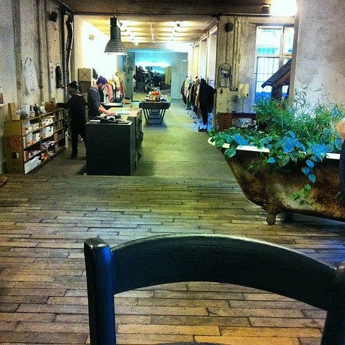
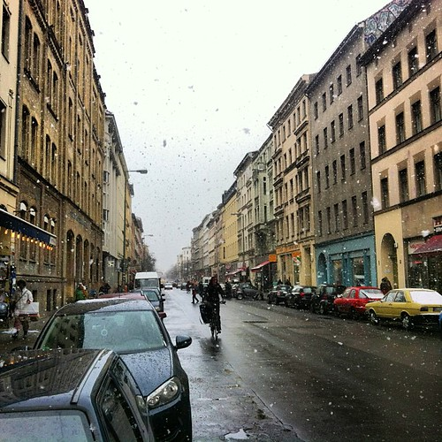
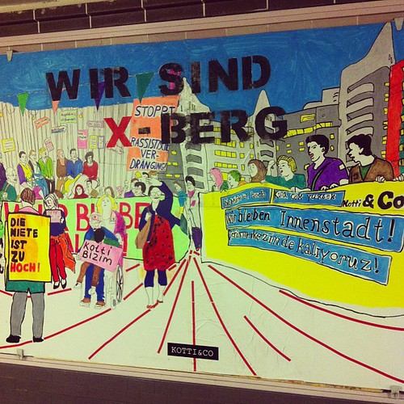
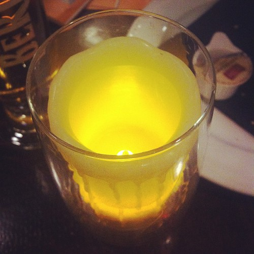

http://twitter.com/thornet/status/303586923719557122

The week was off to a smashing smart with the irregular Iron Blogger Berlin drinks. For some people it is an expensive drinking club, for me with my iron blogging resolve it is more an expensed drinking club.

Berlin weather has been crazy last week. Also again we did tons of stuff for Hubbub, see it over there on [Week 183](http://whatsthehubbub.nl/blog/2013/02/week-183/).

Over at Open State we are still recruiting a managing director to take over operations and lead us up onto the next level of open government and civic innovation. If you are reading this and you are inclined towards getting things done and civic responsibility, do get in touch with us:
http://twitter.com/alper/status/304548937942069248

I was preparing to write a book about the way we've come to work for a while now, but as most books go this was not really happening. So I decided to convert it to a format that is easier to get started on and write it as a series of blog posts right here.

At the end of the week we threw together an impromptu Friday's at Seven here in the neighborhood to end the week and tap into the scenius that is coalescing. We'll definitely do that again and try out various other event formats to see which is the most fun in the long run.

 by illustir, on Flickr")

And Saturday I finally finished Infinite Jest after [having received the hardcopy version](http://www.flickr.com/photos/alper/3200604927/) of it over four years ago. I was quite happy with that if only because I now have time again to read other things (just started [the Quantum Thief](http://en.wikipedia.org/wiki/The_Quantum_Thief)).
