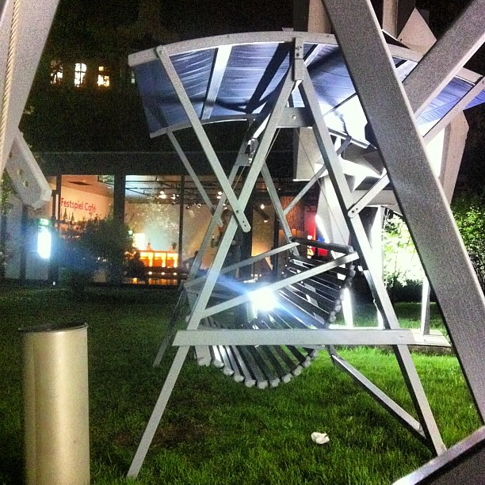
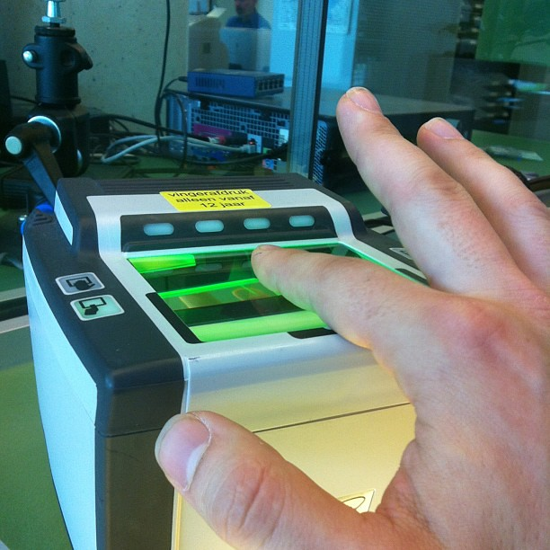
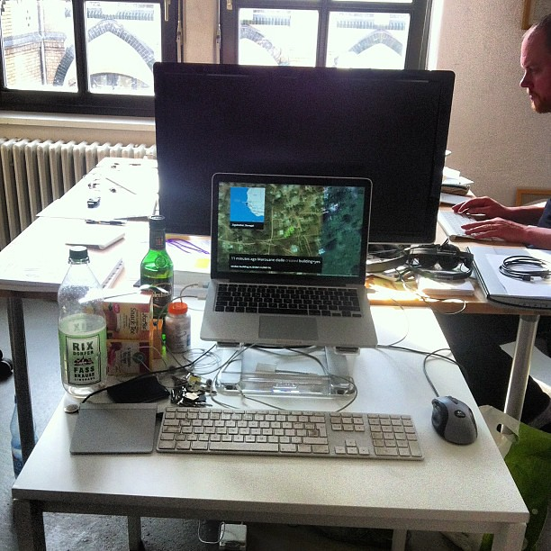
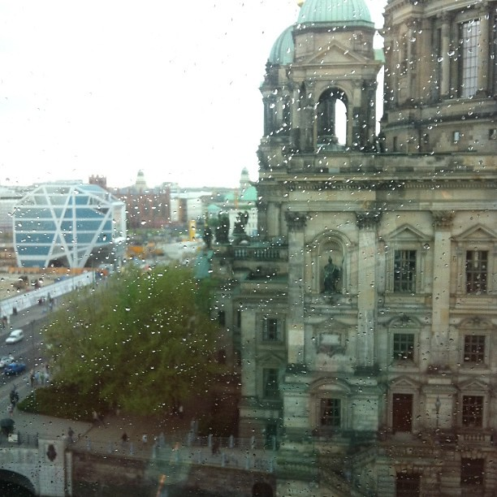

The week before last was filled with theater, a full 9 hours of it which should last me for the rest of the year. I wrote [the one negative review you will find of ‘Krieg und Frieden’](/dingen/2013/05/war-and-peace-under-the-shadow-of-the-apparat/) as a result of it.

I also spent quite a bit of time struggling with German bureaucracy to be able to request a new Dutch passport. It's always a fun thing to do.

And add to that the fact that I was in the middle of moving offices from [Praxis](http://praxisberlin.net/) to [KANT](http://kantberlin.tumblr.com/) and you can say productivity was a bit hampered that week.

 arrangement with @fidothe working in the background by illustir, on Flickr")

I dropped by the [Git-Merge](http://git-merge.com/) event in Berlin which besides hosting the Berlin git community seems to draw out a group of interesting developers. The party they hosted the next day was a great opportunity for me to catchup wit old friend [Cristiano Betta](http://cristianobetta.com/) who is now an evangelist at Paypal.

