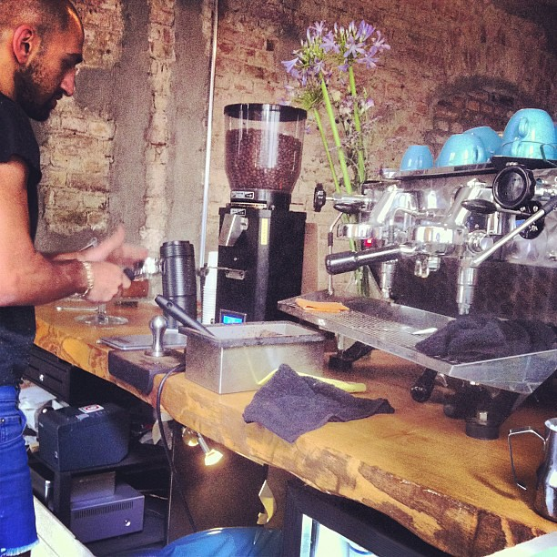
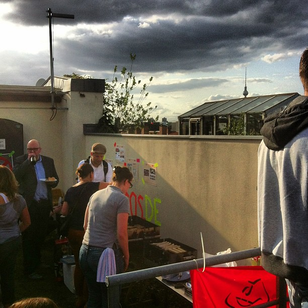
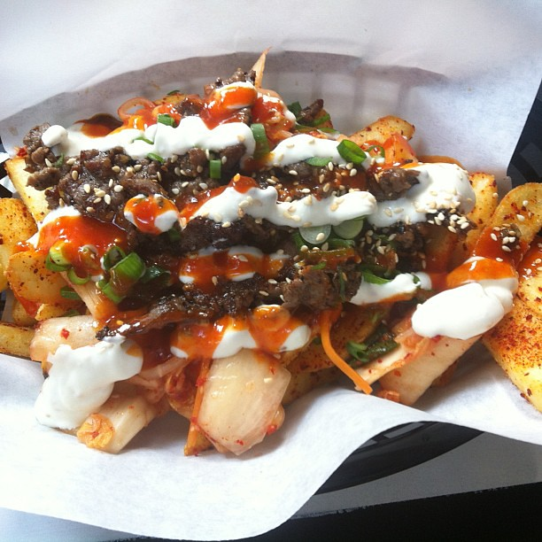
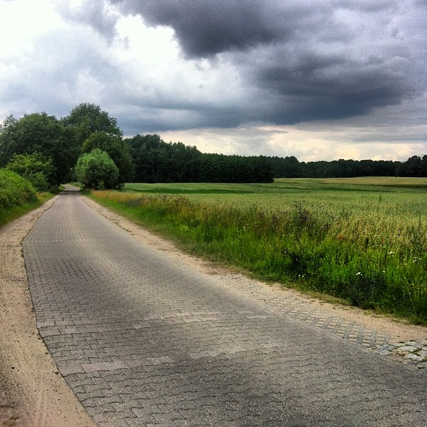
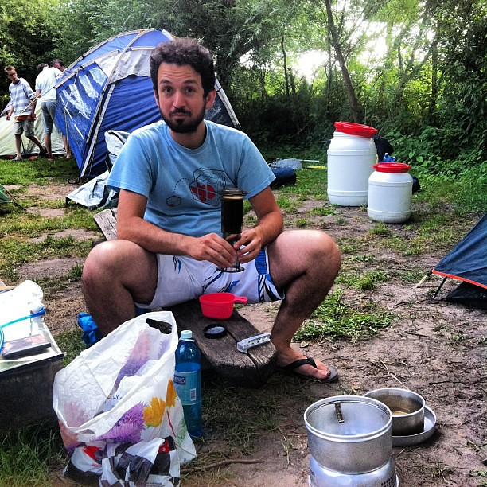

A new coffee place had reportedly opened up in the area and I went out searching for it. [Concierge](https://foursquare.com/v/concierge-coffee/51d3f1e2498e15ad7aa4c00e) is tucked into a gate on Paul-Lincke-Ufer and they are really nice guys pulling quality shots. It is amazing both that this part of Berlin which was quite barren when it comes to coffee is shaping up so nicely and also that

That week we went into our [Open State](http://openstate.eu/) board meeting where everything is picking up in pace considerably. After that I just made it to the drinks of the Upfront UG which was a lot of fun.

We started ideation and building of an app for the piazza+social media platform which I'm rather excited about. More on that over on [the Hubbub blog](http://hbbb.nl) soon.

I will be speaking at [the Retune conference](http://retune.de/) in my hometown on the subject of games with a purpose and our creative process. It looks like a super nice conference and I would love to meet you here.

Our [office landlords](http://p3000.net/) invited us to join them in a celebration on our building's roof terrace. It's been a while since I was on one of those and they look like mandatory facilities for anybody living in Berlin. I'm putting it my list of required utilities for the next KANT office.

Just to prove the awesomeness of Berlin, we just had a [Korean food shack](https://foursquare.com/v/ban-ban-kitchen/51c6054c498e562c29154cb7) opening here (besides the already rather large offering of Korean cuisine that Berlin has). I had my first Kimchi Fries there, which I think is indeed best described as a Korean [kapsalon](http://en.wikipedia.org/wiki/Kapsalon).

On Friday I just handled a last bit of business for the week and then went off to Mecklenburg-Vorpommern (MeckPom) for a bit of kayaking and canoeing which is about all there is to do in that part of Germany. It is a state that is trying to cope with severe shrinkage and because of its sparse population lends itself particularly well to forays into nature. I saw lots of animals and their young and definitely learned the difference between a kayak and a canoe. Also: bringing an aeropress can make situations much more bearable.

