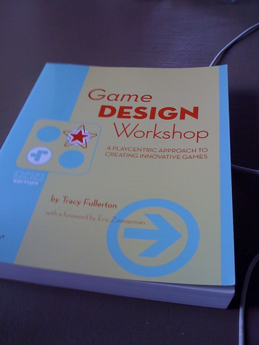
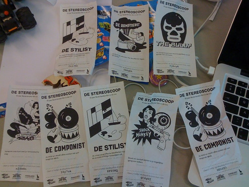
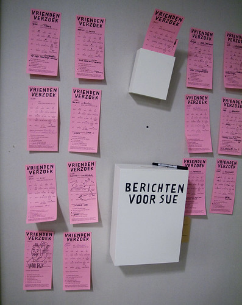

Last week was a short one due to a multitude of other engagements and a weekend trip to [Malmö-Lund-Copenhagen](http://www.flickr.com/photos/alper/sets/72157625096215518/) from which I returned yesterday.

Project _mérida_ which concerns a collaboration with [Buro Pony](http://www.buropony.nl) took up some time and we had a meeting on that on Wednesday.

A bunch of updates on [PLAY Pilots](http://playpilots.nl) were also on the roster and my first (and quite succesful) play at the Stereoscoop during the Film Festival.

An opinion piece I've been writing for a national daily has been accepted, but the urgency of the topic has been pushed aside a bit by current political developments in the Netherlands. Here's hoping it gets published sometime soon.

Wednesday was also the office warming for [Lev Kaupas](http://www.levkaupas.com/) new haunts which was a very lively and entertaining event.

