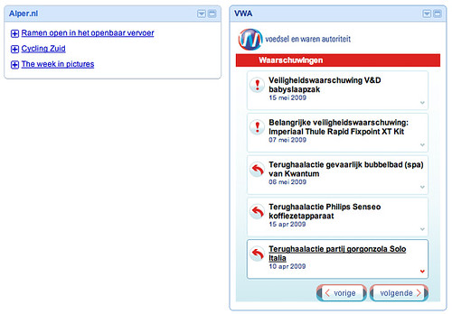

Het is nu een paar weken geleden dat ik de eerste release versie van een serie widgets die ik samen met [Tam Tam](http://www.tamtam.nl) in opdracht van het [Ministerie van Binnenlandse Zaken en Koninkrijksrelaties](http://www.minbzk.nl/) (BZK) heb ontwikkeld ( [een overzichtsartikel](/dingen/2009/05/widgets-overzicht/)).

Doel van het project was om in een breder initiatief aangaande overheid en open data te kijken of met widgets huidige overheidsdata dichter en aantrekkelijker bij de belevingswereld van gebruikers gebracht zou kunnen worden. Er lopen op dit vlak nog meer initiatieven en de grootste uitdaging is de beperktheid van middelen en kennis om de informatie op een goede manier te ontsluiten.

Widgets zijn een nogal onduidelijke term voor kleine specifieke stukjes internet-functionaliteit. Om hier wat duidelijkheid in te verschaffen heb ik [een onderzoek](/dingen/2008/12/widget-distribution-and-other-considerations/) gedaan naar de verschillende platformen. De widgetruimte en spraakverwarring blijft groot en gefragmenteerd en recentelijk zijn er weer enkele initiatieven [op het gebied van mobiele widgets](/dingen/2009/05/mobile-widget-camp/) bij gekomen die nog meer mogelijkheden (en incompatibiliteit bieden).

De widgets staan nu met beschrijving en uitnodiging om samen te werken in [de werkruimte van Overheid2.0](http://www.overheid20.nl/workspaces/index/72) en de [code van de widgets](http://github.com/alper/nlgovwidgets/tree/master) is beschikbaar op github [^1].

### Genericiteit

Uit het onderzoek kwam naar voren dat de verschillende technische widget-platformen veel gelijkenis vertonen en dat er een beweging is naar consolidatie. Een platform als Netvibes gebruikt de overeenkomsten om met hun [UWA](http://dev.netvibes.com/) te proberen één widgetdefinitie te laten draaien op verschillende platformen. In de praktijk valt dit tegen. Het hergebruiken van stukken website is ook een belangrijk onderdeel van [iGoogle/OpenSocial](http://code.google.com/apis/opensocial/) en gezien het grote aantal (sociale netwerk-)sites dat dit ondersteunt [^2] en de aanwezigheid van [een open runtime](http://incubator.apache.org/shindig/) lijkt dit het platform met de grootste impuls.

Het hebben van een generiek platform is belangrijk omdat de problemen vaak hetzelfde zijn en de verschillen klein. Daarom ook is het apart dat er niet meer plaatsen zijn waar [OpenSocial](http://wiki.opensocial.org/index.php?title=Main_Page) widgets te draaien zijn en het is teleurstellend dat [het mobiele widgetplatform van Opera](/dingen/2009/05/mobile-widget-camp/) niet hiermee samenwerkt.

Op zijn simpelst gezegd is een widget een vakje om HTML in te tekenen met specifieke Javascript APIs voor bepaalde functionaliteit. In OpenSocial betreft dit toegang tot de functionaliteit van het omliggende sociale netwerk en op het mobiele platform gaat het om functionaliteit van de mobiele telefoon.

Wij gebruiken dus de OpenSocial [gadgets.\* API](http://code.google.com/apis/gadgets/) van Google zonder de sociale extensies. Deze sociale extensies kunnen in de toekomst altijd nog gebruikt worden, maar dit voegde nogal wat nodeloze complexiteit toe omdat de primaire runtime niet een sociale omgeving is maar een persoonlijk dashboard. De complexiteit zit hem er dan ook niet zo bijzonder in de conditionele javascript maar in de conditionele presentatie waar dan ook meer grafisch/interactie-ontwerp voor nodig is.

De motivatie om tot één generieke widget te komen bleek gerechtvaardigd. Ik heb de widgets gebouwd in de laatste gadgets API versie van Google die ook gebruikt wordt in OpenSocial maar [het iGoogle dashboard](http://www.google.com/ig) werkt zelf nog steeds op [de oude versie van de specificatie](http://code.google.com/apis/gadgets/docs/legacy/dev_guide.html). Het omschrijven van elke widget naar zijn -legacy.xml versie is redelijk triviaal maar het zorgt ervoor dat je dubbel werk doet niet alleen in implementatie maar in het bijzonder ook in het testen (je kunt geen wijzigingen uitrollen zonder een goede test). Dit is al tijdrovend bij 2 soorten widgets; ik denk dat je ervan uit kunt gaan dat de bestede tijd om de verschillende platformen [^3] te ondersteunen vrij snel je complete budget op zal slokken.

### Aanpasbaarheid

Een andere afweging wat betreft de genericiteit van de widgets betreft het maken van een widget of widgetplatform waarin een niet-programmeur door het opgeven van enkele plaatjes, kleuren en een databron automatisch een widget kan laten maken.

Dit is de heilige graal maar het was binnen dit project niet realistisch. Er zijn heel weinig projecten die dit goed doen ( [Sprout Builder](http://sproutbuilder.com/) is eigenlijk de enige die ik ken) omdat het bijzonder moeilijk en bijzonder veel werk. En dit slecht doen is geen optie (dan kun je het beter niet doen).

Bij een halve versie krijg je een rare tussenvorm die lastig werkbaar is en ofwel te weinig vrijheid toe laat of teveel en dan weer teveel voorafgesproken kennis veronderstelt. Dit terwijl het maken van een mooi en goed design juist één van de grootste toegevoegde waarden is die je kunt meegeven aan een widget (zie volgende punt).

We hebben er dus voor gekozen om concrete affe versies te maken maar wel met een redelijk simpele en heldere opmaak en presentatie waardoor ze eenvoudig door wie dan ook te herbranden zijn in een nieuwswidget voor een ander bestuursorgaan. Het deel van de widget dat praat met het platform en de data ophaalt blijft dan gelijk.

### Presentatie

We hebben nogal wat tijd en aandacht besteed met [de ontwerpers van Tam Tam](http://www.tamtam.nl/) samen aan een mooie presentatie van de widgets binnen de huisstijl van de originele site. Je ziet dat dit al snel veel toegevoegde waarde heeft niet alleen in ‘branding’ maar ook in (gebruiks)vriendelijkheid van de gegevens. Vergelijk onze rijkere RSS nieuws-widgets maar met de standaardmanier om RSS te presenteren in iGoogle ( [zie screenshot](http://www.flickr.com/photos/alper/3545024691/)).

Bij de videowidget zie je dat er zonder al teveel moeite al makkelijk de perceptie van een ‘kanaal’ te creëren is, door de layout en de functionaliteit.

Widgets die nu beschikbaar zijn bieden vaak wel interessante functionaliteit en redelijke interactie maar vaak weinig tot geen grafisch ontwerp. Visuele presentatie heeft een sterk effect op de usability en wat dat betreft is er een wereld te winnen.

Waar je denkt aan presentatie denken veel mensen ook aan [Flash](http://en.wikipedia.org/wiki/Adobe_Flash). Onze keuze om geen Flash te gebruiken heeft zich denk ik ook bewezen. Veel interactieve widgets zijn gebouwd in Flash, maar die komen vaak niet veel verder dan een spel, video of [ander grapje](http://www.hyves.nl/gadgetgallery/128/BuddyPoke/) op iemands profiel. Het gebruik van Flash voor normale dingen als tekst en hyperlinks loopt vrijwel altijd uit op een ramp wat betreft gebruiksvriendelijkheid. Daarnaast is Flash slecht begrepen en slecht editbaar. Vergelijk dit met [de publieke git repository](https://github.com/alper/nlgovwidgets/tree) waar het project nu staat en waar het voor iedereen te bekijken, becommentariëren en bewerken is.

### Data

Het idee was om de widgets een uitingsvorm te laten zijn van al bestaande data omdat we dan sneller aan de slag zouden kunnen. We zagen toen al in dat wijzigingen aan de data-aanbiederskant veel tijd zouden kosten. Uiteindelijk zijn er wijzigingen nodig geweest voor alle databronnen behalve één (die van het VWA waar al een RSS-feed beschikbaar was), duurden die wijzigingen inderdaad heel lang als ze al kwamen want er zijn nog steeds twee databronnen niet af.

De beschikbaarheid van data is het belangrijkste punt en iets waar [Ton en James](http://ambtenaar20.ning.com/group/openoverheid) mee bezig zijn in hun project. Er zijn een boel dingen nodig: bereidheid om data beschikbaar te maken, middelen om het te bewerkstelligen, richtlijnen voor de uitvoer [^4], een geschikt uitvoerformaat en distributiestrategie.

Verder als je echt begint te werken met de standaarden die we nu voor handen hebben merk je dat er veel nog in de kinderschoenen staat. Er is weinig bewezen en getest en er is ook lang niet overal code voor. Dit is geen pleidooi om het dan maar niet te doen en overal Excel sheets en PDFs online te zetten, integendeel; we leren dit soort dingen alleen maar door het te doen.

### Platformafhankelijkheid

De aanwezigheid van een open implementatie van Shindig beperkt je afhankelijkheid van derde partijen voor platformen in zeker mate, maar over het algemeen gesproken zullen mensen widgets toch graag willen plaatsen op hun vaste plekken.

De OpenSocial standaard wordt nog niet overal even goed toegepast en naast de technologische verschillen hebben de verschillende platformen ook verschillende ontikkelaarsrichtlijnen voor projecten. [LinkedIn](http://www.linkedin.com) is bijvoorbeeld erg gesloten terwijl Hyves relatief weinig eisen stelt.

Bij het testen van onze OpenSocial gadgets kwam ik erachter dat ze het op [Ning](http://www.ning.com) bijvoorbeeld helemaal niet doen [^5]. Op Hyves was er wat herschrijven nodig en zitten er nog wat kleine fouten in het platform waardoor de widgets niet perfect werken maar wel werkbaar zijn. En recentelijk liggen de widgets er af en toe compleet uit in iGoogle waarna ze na een paar dagen weer terug komen [^6].

Dit is allemaal jammer, maar dat is één reden waarom kiezen voor het grootste en actiefste platform belangrijk is. Op die manier is er temminste een kans dat deze problemen in een toekomstige update opgelost worden.

### Groeikansen

Wat de widgets betreft nodigen we iedereen die wil uit voor participatie ofwel op conceptueel niveau in [de werkruimte van overheid20](http://www.overheid20.nl/workspaces/index/72) ofwel in [de code op github](http://github.com/alper/nlgovwidgets/tree/master). Op zijn lichtst gezegd kan de participatie daar wel iets hoger.

Verder staan er op ons verlanglijstje nog een serie generieke widgets die de basisfunctionaliteit bevatten en die door iemand met kennis van HTML/CSS snel te rebranden zijn voor een specifiek doel. Video-, Event- en RSS-widgets hebben we nu al, op het verlanglijstje staat nog een Image-widget (plaatje(s) van de dag) en een echte kaart-widget om maar iets te noemen. Deze widgets zouden niet alleen bruikbaar zijn binnen de overheid maar overal waar hier behoefte aan is.
Als er code op andere plaatsen beschikbaar is, die past bij deze doelstelling hou ik me aanbevolen. En patches kunnen mijn richting op, hoe meer hoe beter.

Uiteindelijk is de beschikbaarheid van data essentieel. Je ziet hoe lastig het is voor een project om met mandaat maar zonder paraat beschikbare data te opereren. Andersom denk ik dat als er maar data beschikbaar is dat mensen dan vanzelf uit interesse of al naar gelang behoefte wel iets zullen maken. Zonder data gaat dat in elk geval niet gebeuren.
Wat daar wel bij opgemerkt moet worden, is dat je goed grafisch design bijna alleen maar ziet bij dit soort betaalde projecten waar professionele grafische ontwerpers [^7] worden ingezet en zoals ik al zei is dat ook een essentieel onderdeel (maar slecht ontworpen is nog steeds beter dan niks).

[^1]: We hebben geen licentie afgesproken, maar ik weet vrij zeker dat je niet gesued zult worden.
[^2]: Netvibes ondersteunt OpenSocial widgets al een tijdje in hun ontwikkelversie, maar ze hebben het nog niet op de site aan gezet, misschien omdat dit de doodsteek zou betekenen voor hun UWA.
[^3]: En dan hebben we het nog niet eens over de verschillende browsers als platform. IE6 is een beperkende factor en het zou misschien het meest twee-punt-nulle zijn wat de overheid kan doen om overheidswijd IE eruit te flikkeren (Chrome schijnt goed te zijn…).
[^4]: Als we data dan herbruikbaar maken, laten we het dan in één keer goed doen.
[^5]: Jammer, want Ning is een redelijk belangrijk doelplatform.
[^6]: Al [aangemeld](http://code.google.com/p/igoogle-legacy/issues/detail?id=535&q=information%20unavailable&colspec=ID%20Type%20Stars%20Summary%20Status), laten we hopen dat het probleem zichzelf opklaart. Google is niet heel responsief.
[^7]: Gek genoeg zijn ontwikkelaars best bereid om bij te dragen aan open source projecten maar zijn de meeste ontwerpers er niet voor te porren. Nu kun je ook vraagtekens zetten bij de kwaliteit van de code die daar geproduceerd wordt, maar dat is een ander verhaal.
