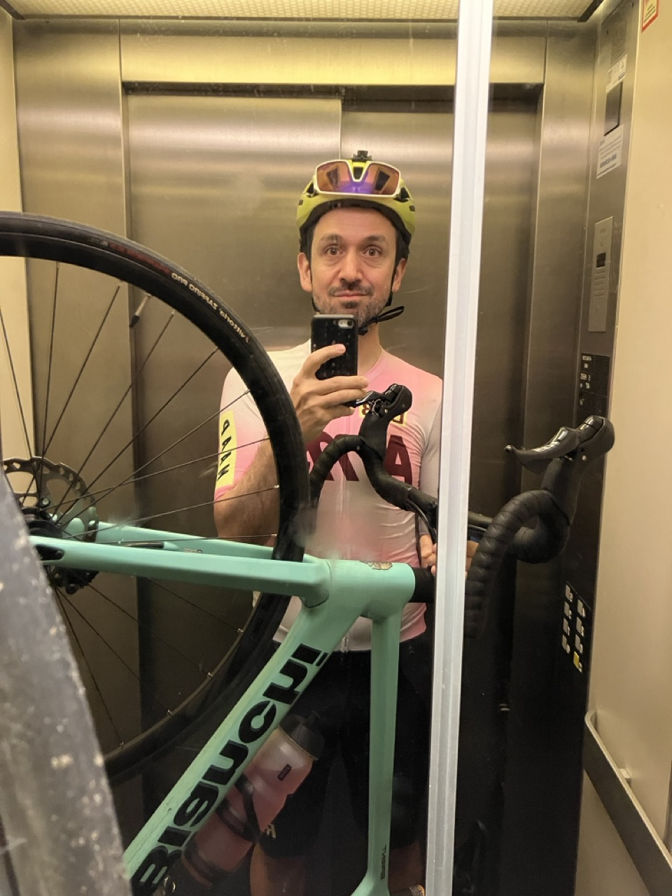
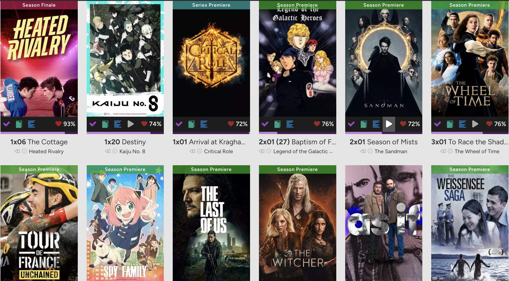
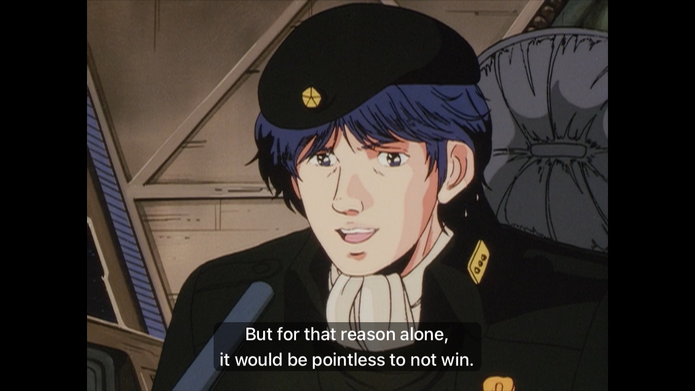
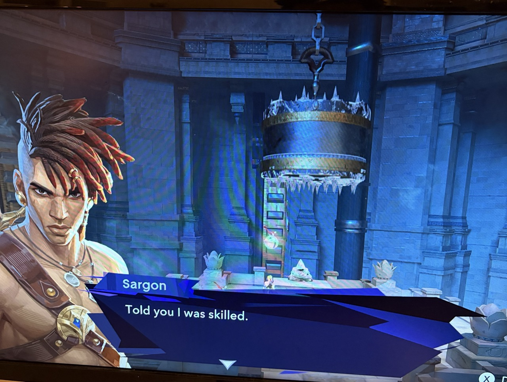
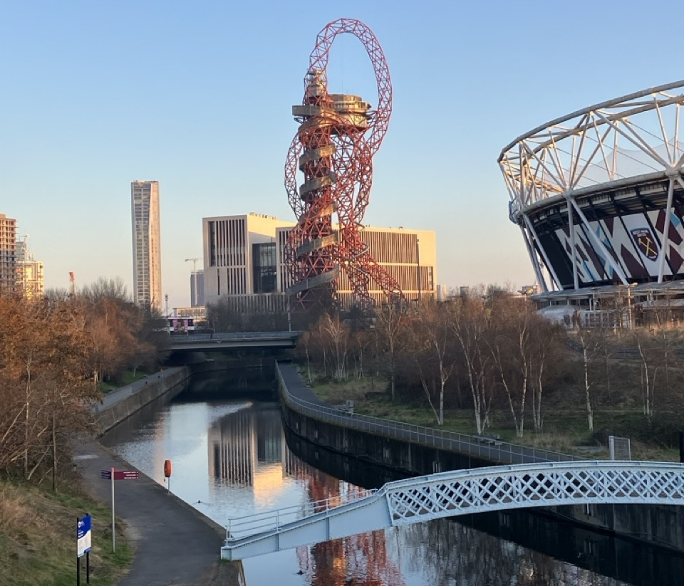
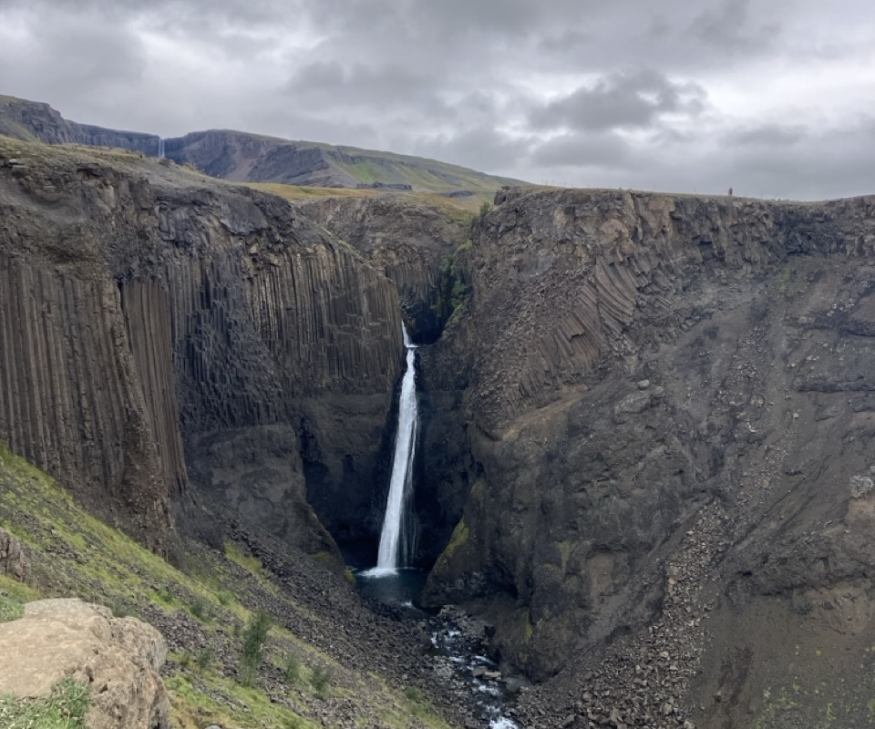
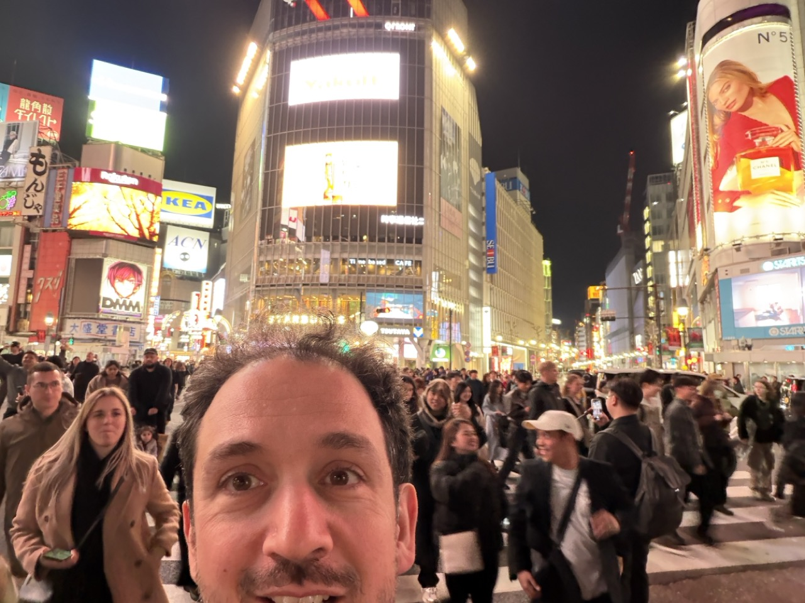

## Sports and Health

It was a year where I didn't seriously injure myself and could continuously practice sports. That's already a huge improvement.

I started going to the gym regularly in the evenings after the kids are sleeping. After some initial hesitance I started doing barbell exercises. The goal is to squat and deadlift at least my bodyweight of 75kg. I'm inching this up very slowly and am currently at 40kg.

Going to the gym is made possible by my Fitbod subscription. Exercising regularly is much easier, if I don't have to think or plan what I'm going to do. That means either a human or an app should tell me what I need to do. Given that the gym is paid for by my work, I can justify the steep monthly cost of Fitbod (here's [a 14-day guest pass](https://go.fitbod.link/XprO/8ovqn6mu)).

I'm doing winter cycling on the trainers at the gym while I debate whether I should get one for at home. That makes me one of those crazy people who wears a *chamois* to the gym.

It was a great year for cycling. I bought a proper road bike, the Bianchi 2024 Sprint ICR and I managed to join group rides (mostly those of the MAAP LAB Berlin) more or less weekly without having a single mechanical or crash. *knocks on wood*

But then during a solo ride in the last week of the year I managed to slip and fall over. More than the minor damage to my knee and my carbon frame, it was my ego that was bruised.

## Studies

I read a bunch of papers ([one write-up](/posts/17833/)) around LLMs and found the field to be overhyped. I don't think that single percentage point increases in performance and conversions of [BFS](https://en.wikipedia.org/wiki/Breadth-first_search) algorithms into LLM prompts are worth writing up. Things are moving so quickly that you can't sit around waiting for breakthroughs to make their way into the literature.

Learning Japanese continues and I'm now at [Wanikani level 22](https://www.wanikani.com/level/22). I'm not sure what my next goal is going to be. After my trip to Japan my motivation is somewhat on the rocks.

The main problem is that once you start studying Japanese, you cannot stop. I'm not stopping, but I'm dialing it down to maintenance mode.

## Books

I already posted about [how bad of a year 2025 was for readin](/posts/18731/). Not sure whether I'll find the time to do better next year.

## Movies and TV

I've moved the tracking of everything that I watch over to [Trakt](https://trakt.tv) saying goodbye to Letterboxd.

Just like with fitness, I need an app that will tell me exactly what I need to do right now. Without it, I'll very easily lose track of this. Trakt is excellent at this and offers it in the free version. I pay for premium to get some of the more advanced list management versions.

The movies I watched in 2025:

* Wicked
* Moana 2
* Neon Genesis Evangelion: The End of Evangelion
* Harry Potter and the Prisoner of Azkaban
* Lilo & Stitch
* KPop Demon Hunters
* Encanto
* The Greatest Showman

Trakt tells me that's 901 minutes spent on movies.

Wicked was lovely on the big screen. Of the kids movies I watched: KPop Demon Hunters is impeccable, Moana 2 was unnecessary, Encanto was strangely forgettable, Lilo & Stitch not as bad as I would expect. The Greatest Showman may be flawed but it is full of bangers.

The tv series I watched in 2025:

* Bluey S3
* The Wheel of Time S2
* The Bear S1+S2+S3+S4
* Neon Genesis Evangelion
* Dennou Coil
* Asura
* Cyberpunk Edge Runners
* Legend of the Galactic Heroes S1
* Heated Rivalry S1
* Kaiju No.8 S1

All of these were spectacular and interesting in their own way. The Bear really meshes with so many things I like and like to do. Asura is effectively just a very long [Kore-eda](https://trakt.tv/people/hirokazu-kore-eda?sort=released,asc) movie. LotGH is peak.

Trakt tells me that this is 4567 minutes spent on episodes. It's clear who's the winner here.

## Games

I don't really track this anymore, but what I can note are the following.



**Expedition 33** was a highlight. I saw it on Tiktok and immediately knew I had to experience it. Not having a console I played it via [cloud gaming](https://boosteroid.com) on my Macbook.

Playing a parry/dodge game over a cloud setup is pure masochism, but with difficulty set to easy, it was kind of doable. The gameplay loop is satisfying but after a while the level design formula gets a bit tedious. What stood out were the music[^1], the writing and the major set pieces in the boss battles and in the environment.



**Critical Role** started their campaign 4 and having followed the online RPG scene through Tiktok clips for a while now, I decided to see what the fuss was about. The [first episode](https://trakt.tv/shows/critical-role/seasons/4/episodes/1) together with the rest of the ouverture is spectacular. It's a narrative victory of setup, emotions, reveals and backstabbing. I'm not sure if they'll stick the landing, but for now I'm very much bought in.

I'll have to delve into what makes this worthwhile. For now I can point to two things. There is an element of let's play parasociality that you have with any game stream or impro podcast. Add to that a very meticulously brewed high fantasy setting that's better than what we get on television: open ended runtime, infinite production values, no cancellation after one or two seasons.

**Prince of Persia: The Lost Crown** was discounted and became the game we played during the Christmas break. I led exploring the city on Mount Qaf with my kids on a lower difficulty following right on my heels.

It's a great game where the platform mechanics continue to layer on top of each other together with some very nasty puzzles bordering on the outright sadistic. I'm super proud to see the grit and skill my kids have shown because easy only affects combat, not the platforming.

Persia provides a vast and mostly unknown to us landscape of culture, artifacts and mythology to serve as backdrop for this game. A lot of it is undoubtedly historically not accurate, but that does not make it any less nice to look at.

## Podcasts

The two podcasts I listen to most consistently are [Ones and Tooze](https://foreignpolicy.com/podcasts/ones-and-tooze/) and [Past Present Future](https://www.ppfideas.com). Those are both remnants of my [Talking Politics](https://www.talkingpoliticspodcast.com) period[^2]. Maybe I should add [Helen Thompson's](https://www.polis.cam.ac.uk/Staff_and_Students/dr-helen-thompson) podcast as well and have a full lid?

Other than that I semi-regularly listen to:

* The Adam Friedland show
* The Catskills Podcast
* Cortex
* Developer Voices
* Escape Collective (only during the Tour)
* Feminist Shelf Control
* KALT'ın Podacst'ı
* Oxide and Friends
* Podcast Filosofie
* De Shitshow
* Stavy's World
* Vergecast

I more or less stopped listening to [Trashfuture](https://trashfuture.co.uk) finding the jokes and the commentary repetitive and boring.

## Travel

It was a much better year for travel than most years before this.

**London** was a work trip in spring and it was one of my best London trips ever. I stayed in Chelsea, I cycled everywhere, drank lots of great coffee, ate a ton of great food, went to a club, went to [a play on the West End](https://www.thedukeofyorks.com/elektra). I did so much and there's so much left to do. I don't know what took me so long to appreciate London like this.

**Iceland** was the first trip we took our kids on a plane and then round tripped the island on our way to the family horse farm. Iceland is lovely but empty. Not sure what would make me go back there other than to visit family or if I could do some hard hiking/cycling/riding.

**Japan** drove me crazy with reports from everybody and their mother visiting so I *had to* go. After missing the summer window, I booked for November not knowing that that's one of the best months to visit Japan. I [walked the Ise-ji](https://alper.nl/series/iseji/) for a large chunk and then I ran around Tokyo for a couple of days. It was even better than all the social media.

Iceland *and* Japan in the same year is low-key ridiculous but this was also the year at work where I get 20 consecutive extra holidays.

## End

Lots more things to cover that happened in 2025 but for now this will have to be it. Despite some marked down periods, all in all it was a good year. On to a much better 2026.

[^1]: It's super cold that one of the most impactful songs starts during a boss battle and if you listen to the music, the boss has initiative and he gets free hits on you.
[^2]: Who didn't have a Talking politics period?

*(This update has been delayed for a week because I fell quite ill just as the new year came around.)*